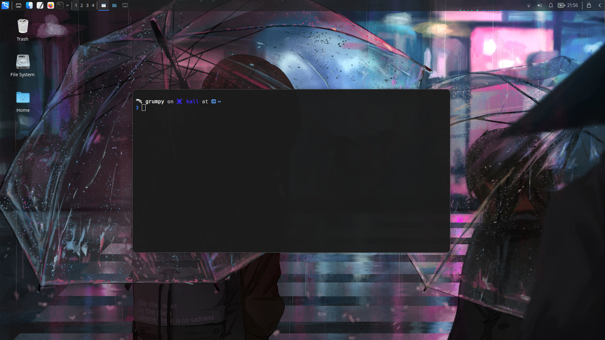

<h1 align="center"><code>⚙️</code> <strong>Kali Linux's Dotfiles</strong></h1>

<div align="center">
  
</div>

## `📸` Screenshots

### `XFCE`



### `Neovim`


## `📖` About

I use Kali Purple Linux with one session: **XFCE**. I provide my dotfiles for you to use. Feel free to use it. I will update this repository if I have a new configuration.

This repository contains my personal dotfiles for Kali Linux. It contains my configuration for the following tools:

| Tool                                                                            | Description                                                        |
| ------------------------------------------------------------------------------- | ------------------------------------------------------------------ |
| [xfce](https://www.xfce.org/)                                                   | A lightweight desktop environment for UNIX-like operating systems. |
| [Fish](https://fishshell.com/)                                                  | A smart and user-friendly command line shell.                      |
| [Alacritty](https://alacritty.org/)                                             | A cross-platform, GPU-accelerated terminal emulator.               |
| [Neovim](https://neovim.io/)                                                    | A hyperextensible Vim-based text editor.                           |
| [Neofetch](https://github.com/dylanaraps/neofetch)                              | A command-line system information tool written in bash 3.2+.       |
| [Ranger](https://github.com/ranger/ranger)                                      | A console file manager with VI key bindings.                       |
| [mpd](https://www.musicpd.org/) & [ncmpcpp](https://github.com/ncmpcpp/ncmpcpp) | A flexible, powerful, server-side application for playing music.   |
| [Homebrew](https://brew.sh/)                                                    | A package manager for macOS.                                       |
| [Spicetify](https://spicetify.app/)                                             | A command-line tool to customize Spotify client.                   |
| [Blackbox Terminal](https://gitlab.gnome.org/raggesilver/blackbox)              | A terminal a beautiful and customizable terminal with GTK4.        |
| [Warp Terminal](https://warp.dev/)                                              | A terminal integrated with AI to make you more fantastic.          |

> **Note**: I have wallpaper on **[.github/wallpaper](./.github/wallpaper/)** directory. You can use it if you want. (In further update, I will add more wallpaper)

## `📦` Installation

> **Warning**: Don't AFK while installing this dotfiles. You might miss some important prompts. I recommend you to read the script first before running it. You can also install the dotfiles manually by copying the files to their respective directories. I recommend you to use the script instead. It's easier and faster.

### `📥` Prerequisites

```bash
curl https://raw.githubusercontent.com/PunGrumpy/kali-dotfiles/main/RiceInstaller.sh -o $HOME/.RiceInstaller.sh
```

### `📥` Installation

```bash
chmod +x $HOME/.RiceInstaller.sh
```

### `📥` Usage

```bash
$HOME/.RiceInstaller.sh
```
